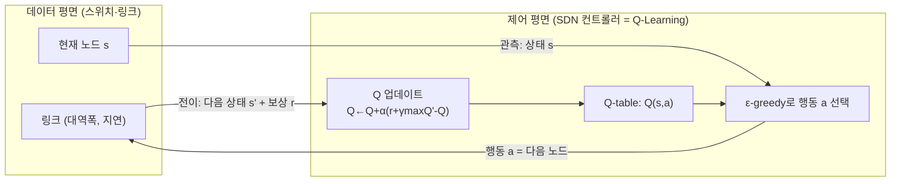

# SDN + Q-Learning 예제: 상태·행동·보상 한 페이지 도식

`sdn_qlearning_implementation.py`의 **그래프 라우팅 시뮬레이션**을 SDN 관점으로 옮겨 놓은 그림입니다. (실제 OpenFlow 메시지까지는 구현하지 않고, **컨트롤러가 결정하는 “다음 홉”**에 해당합니다.)

---

## 1) 한 줄 요약

| 요소 | 이 예제에서의 의미 | SDN에서의 대응(직관) |
|------|-------------------|----------------------|
| **상태 \(s\)** | 에이전트가 **지금 있는 노드(스위치) ID** | “현재 패킷이 위치한 스위치” 또는 그 스위치에서 관측한 **링크/큐 상태 요약** |
| **행동 \(a\)** | **다음으로 보낼 이웃 노드** (그래프의 아웃엣지) | **출력 포트 / 다음 홉** 으로 내려갈 플로우 규칙의 핵심 |
| **보상 \(r\)** | 선택한 링크의 **대역폭·지연**으로 만든 스칼라 + 목적지 도달 보너스 | QoS 목표(대역폭↑, 지연↓)를 숫자 하나로 압축한 “품질 점수” |

---

## 2) 제어 루프 도식 (Mermaid)

아래는 **한 에피소드** 안에서 컨트롤러(에이전트)가 반복하는 루프입니다.

**종료 조건:** `s'`가 목적지 노드이면 해당 에피소드 종료(그리고 코드에서는 도착 보너스를 `r`에 더함).

---

## 3) 보상이 만들어지는 방식 (이 코드 기준)

에이전트가 노드 `src`에서 이웃 `dst`로 **한 홉** 보낼 때:

1. 링크 `(src, dst)`의 **대역폭·지연**으로 점수 계산  
   `r_link = 0.5 * (BW/BW_max) + 0.5 * (1 - delay/delay_max)`
2. 목적지에 **도착한 스텝**이면 추가로 `+10` (도착 보너스)

즉 SDN 말로 하면, “**이 포워딩 결정이 QoS에 얼마나 좋은가**”를 한 스텝마다 숫자로 주는 셈입니다.

---

## 4) 실제 SDN으로 확장할 때 바뀌는 부분(참고)

| 이 예제 | 실제 SDN에 가깝게 확장 |
|---------|-------------------------|
| 상태 = 노드 ID | 상태 = **포트별 큐 길이, 이용률, 손실률** 등 벡터(또는 요약 통계) |
| 행동 = 이웃 노드 번호 | 행동 = **출력 포트 / 터널 ID / ECMP 멤버 선택** |
| 보상 = BW·지연 스칼라 | 보상 = SLA 위반 페널티, 지연 목표, 처리량 등 **복합 지표** |

---

## 5) 코드 위치 빠른 링크

| 개념 | 파일 내 위치 |
|------|----------------|
| 환경(링크, `step`, 보상) | `NetworkEnvironment` |
| Q-Learning + ε-greedy | `QLearningAgent` |
| 학습 후 경로 추출 | `greedy_path()` |
| 비교 기준 경로 | `BaselineRouter.shortest_hop_path()` |

이 한 페이지로 “컨트롤러가 무엇을 상태로 보고, 무엇을 행동으로 내리고, 무엇을 보상으로 학습하는지”를 정리했습니다.
